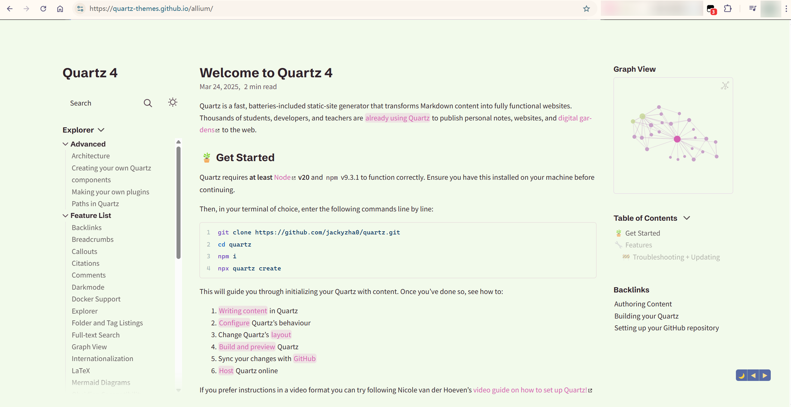

# Quartz-Themes Preview Switcher

[English](README.md) | [Chinese](README.zh_CN.md)

Switch between different theme effects of [quartz-themes](https://github.com/saberzero1/quartz-themes/tree/master) quickly by using the '◀' and '▶' buttons.

## Installation

1. Install a browser extension like Tampermonkey (for Chrome) or Greasemonkey (for Firefox).
2. Click on [this link](https://github.com/Tuscan-blue/quartz-themes-preview-switcher/raw/refs/heads/main/quartz-themes-preview-switcher.user.js) to install the script.

## Steps

1. Enable this script.
2. Navigate to [quartz themes preview: 80s-neon](https://quartz-themes.github.io/80s-neon)
3. Click on the '◀' and '▶' buttons to switch between different theme effects.

## Features

- Quickly switch between different themes of quartz-themes.
- Use the convenient '◀' and '▶' buttons for navigation.
- Easily preview different quartz-themes themes to help you find your favorite one.

## Screenshots

Please pay attention to the two buttons in the bottom right corner.

## License

This project is licensed under the MIT License - see the [MIT LICENSE](LICENSE) file for details.