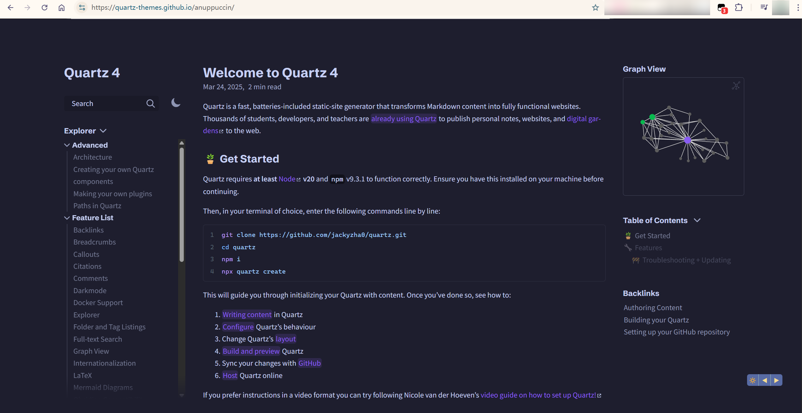

# Quartz-Themes 主题效果预览切换器

[英文](README.md) | [中文](README.zh_CN.md)

通过使用 '◀' 和 '▶' 按钮，快速预览 [quartz-themes](https://github.com/saberzero1/quartz-themes/tree/master) 的不同主题效果。

## 安装

1. 安装一个形如 Tampermonkey（Chrome）或 Greasemonkey（Firefox）的浏览器拓展应用。
2. 点击 [此链接](https://github.com/Tuscan-blue/quartz-themes-preview-switcher/raw/refs/heads/main/quartz-themes-preview-switcher.user.js) 或者 [GreasyFork: quartz themes preview switcher](https://greasyfork.org/en/scripts/531094-quartz-themes-preview-switcher) 安装脚本。

## 步骤

1. 启用此脚本。
2. 打开 [quartz-themes主题预览：80s-neon](https://quartz-themes.github.io/80s-neon)。
3. 点击 '◀' 和 '▶' 按钮，切换不同的主题以方便快捷地预览不同的主题效果。

## 特点

- 快速切换 quartz-themes 的不同主题。
- 使用便捷的 '◀' 和 '▶' 按钮进行导航。
- 可以快捷地预览不同的 quartz-themes 主题，方便筛选出你所喜欢的主题。

## 截图

请注意右下角的两个按钮。

## 许可证

本项目使用 MIT 许可证 - 详情请参阅 [MIT LICENSE](LICENSE) 文件。
